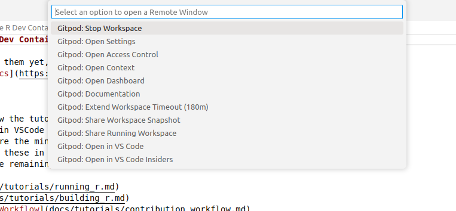
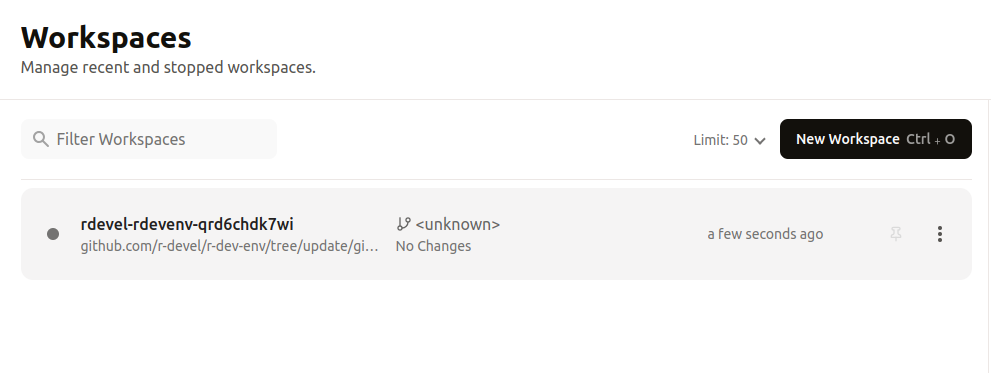

### Starting a Gitpod Workspace

1. **Log In:**
Go to the [Gitpod login page](https://gitpod.io/login/) and sign in with your GitHub, GitLab, or Bitbucket account. This allows Gitpod to create workspaces from your repositories.

2. **Choose Your Repository:**
You can also use a Gitpod badge, which will redirect you to the Gitpod workspace creation dashboard page.

     
3. **Create a New Workspace:**
In the Gitpod dashboard, click on the "Continue" button. You can change the resource option from standard to large. After clicking continue, it will take approximately 15-20 minutes to create the workspace for the first time. It will cache the environment for faster startup in the future.

!!!Note
     Changing the resource option will reduce the free monthly Gitpod usage, which is 50 hours per month.

### Stopping a Gitpod Workspace

1. **Locate the Gitpod Command Palette Button:**
To stop the current workspace, look for the orange Gitpod command palette button in the bottom left corner of the workspace.

   
2. **Open the Command Palette and Stop the Workspace:**
After clicking on the Gitpod command palette button, a pop-up will appear from the top of the screen. Select the Gitpod: Stop Workspace option to stop the current workspace.

!!!Note
    Stopping a workspace will save its state, so you can resume later without losing your progress. However, keep in mind that stopped workspaces still count towards your monthly usage quota.

### Restarting a Gitpod Workspace

1. **Open Gitpod Dashboard:**
Once you're in the Gitpod dashboard, navigate to the "Workspaces" section. In the "Workspaces" section, you will see a list of your current and past workspaces. Locate the workspace you want to restart. Stopped workspaces will have an indicator showing they are not running.

   
2. **Restart the Workspace:**
To restart a workspace, click on the workspace in the list you want to restart. This will launch the workspace, restoring it to the state it was in when it was last stopped.